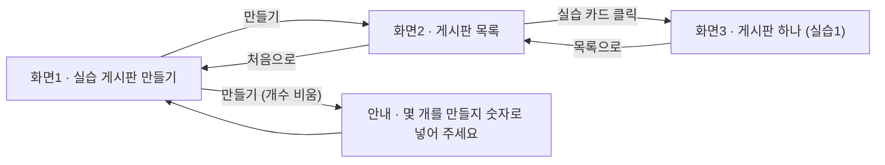

# 화면 흐름도

```mermaid
flowchart LR
    A["화면1 · 실습 게시판 만들기"]
    B["화면2 · 게시판 목록"]
    C["화면3 · 게시판 하나 (실습1)"]
    D["안내 · 몇 개를 만들지 숫자로 넣어 주세요"]

    A -->|만들기| B
    A -->|"만들기 (개수 비움)"| D
    D --> A
    B -->|실습 카드 클릭| C
    C -->|목록으로| B
    B -->|처음으로| A
```
